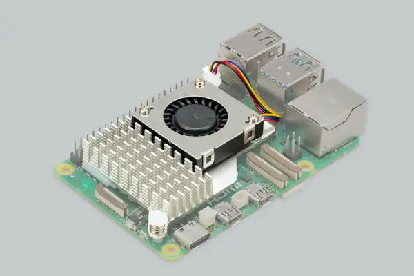

***************
Raspberry PI 5
***************

Ce projet utilise un Raspberry PI 5 comme carte de développement principale.

    Raspberry Pi 5 avec son module de refroidissement

La liste des informations relative à la carte et aux accessoires utilisés sont disponibles sur le site de `Raspberry <https://www.raspberrypi.com/products/raspberry-pi-5/>`_.

Les cartes étant partagées entre plusieurs groupes, le second groupe utilisant notre maquette a monté le module de refroidissement ainsi qu'un disque dur ADATA de 256 Go. Ce disque dur sera partagé entre les deux groupes, afin de différencier les deux groupes, deux profils d'utilisateur seront crées.