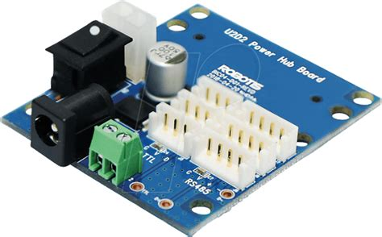

************
Module U2D2
************

Le pantographe est actionné par deux dynamixels `AX-12A <https://emanual.robotis.com/docs/en/dxl/ax/ax-12a/>`_ et un module `U2D2 <https://emanual.robotis.com/docs/en/parts/interface/u2d2/>`_. Le module U2D2 est un convertisseur USB vers TTL permettant de communiquer avec les dynamixels.

    Convertisseur U2D2