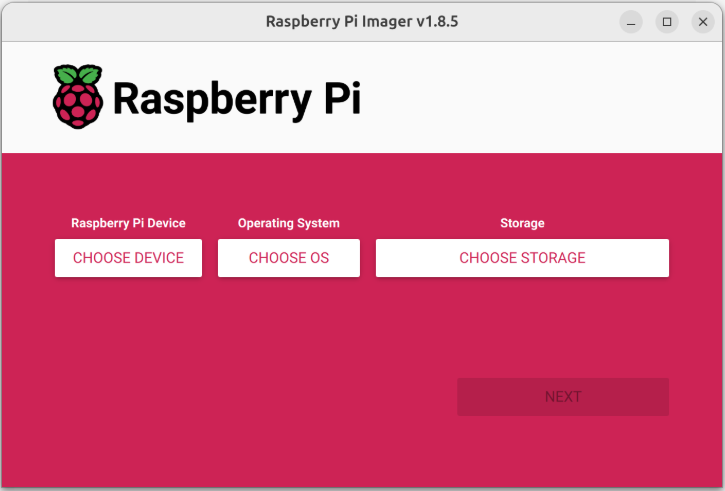

********************************************
Installation d'Ubuntu sur le Raspberry Pi 5
********************************************

Afin d'installer Ubuntu LTS 24.04 sur un Raspberry Pi 5, il faut une fois le Raspberry Pi connecté, lancer Pi Imager, cette fenêtre devrait alors apparaître :

    Image d'accueil de Pi Imager

Dans un premier temps, il faut sélectionner le modèle du Raspberry Pi 5 utilisé. 

Dans un deuxième temps, il faut sélectionner le système d'exploitation. Ici nous avons pris la version Ubuntu LTS 24.04 Desktop.

.. warning::

   Attention une version existe pour les serveurs mais elle ne nous intéresse pas pour notre application.

Dans un troisième temps, il faut sélectionner l'emplacement où sera installé Ubuntu. Nous avons essayé de partitionner notre disque en deux, cependant cette opération n'a pas marché, la différenciation des groupes se fera en créant un second profil sur Ubuntu.

Lors de la première installation, une erreur est survenue. Nous avons été contraint d'effacer toutes les données du disque dur et d'installer une seconde fois l'OS. Cette seconde installation s'est déroullée sans accroc.

Une fois ceci fait, nous avons créer un profil utilisateur correspondant à notre groupe.

#######################
Sources documentaires
#######################

#. `Documentation Officielle de Ubuntu pour Raspberry Pi 5 <https://ubuntu.com/download/raspberry-pi>`_

